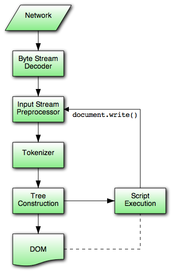

# HTML解析器 - HTML Parser

## Summary
HTML解析器的工作就是将HTML标识(签)解析为解析树

### 什么是HTML标识
首先我们得对HTML有个基础的概念:
* HTML(Hyper Text Markup Language) 是用来**描述网页**的一种语言。
* HTML文档实际上就是我们称的网页
* Web浏览器的作用是读取HTML文档，并以网页的形式显示出它们。而我们要讲的HTML解释器就是负责读取HTML文档并转化为后续所需结构的一个浏览器内核模块。

## 解析算法

### HTML语法特性
* **宽容** 它允许忽略一些特定标签，有时可以省略开始或结束标签。
* **浏览器容错**  浏览器对一些常见的非法html有容错机制
* **解析过程往复** 脚本标签具备增删改标签的能力

### 符号化
符号化是词法分析的过程，将输入解析为符号，html的符号包括开始标签、结束标签、属性名及属性值。  

#### 符号识别算法
算法输出html符号，该算法用状态机表示。每次读取输入流中的一个或多个字符，并根据这些字符转移到下一个状态，当前的符号状态及构建树状态共同影响结果，这意味着，读取同样的字符，可能因为当前状态的不同，得到不同的结果以进入下一个正确的状态。
```
<html>
    <head>
        <title></title>
    </head>
    <bod>
        Hello World
    </body>
</html>
```
Date State阶段: Tag Open State, Tag Name State, Data State
### 构建树

#### 树的构建算法
* 在树的构建阶段，将修改以Document为根的DOM树，将元素附加到树上。每个由符号识别器识别生成的节点将会被树构造器进行处理，规范中定义了每个符号相对应的Dom元素，对应的Dom元素将会被创建。
* 这些元素除了会被添加到Dom树上，还将被添加到开放元素堆栈中。这个堆栈用来纠正嵌套的未匹配和未闭合标签，这个算法也是用状态机来描述，所有的状态采用插入模式。
输入：符号识别阶段生成的符号序列


## 解析结束时的处理
* 浏览器将文档标记为可交互的，并开始解析处于延时模式中的脚本——这些脚本在文档解析后执行。
* 文档状态将被设置为完成，同时触发一个load事件。

PS: [W3C提供的完整文档](https://www.w3.org/TR/html5/syntax.html#html-parser)