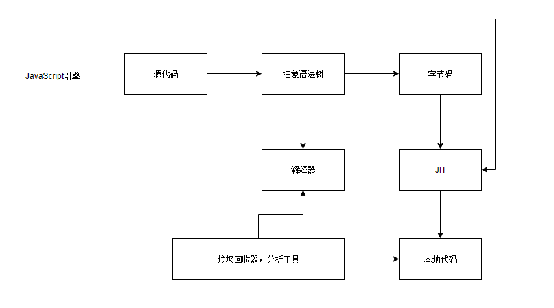
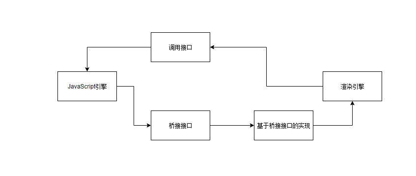

# JavaScript引擎
JavaScript引擎是能够将JavaScript代码处理并执行的运行环境。
## JavaScript语言
* JavaScript是一种脚本语言，本质上是一种解释型语言
* JavaScript是一种弱类型语言，或者说动态类型语言，相较于Java等静态类型语言，Java在编译时候就知道变量的类型，而JavaScript需要在运行时才能确定，这导致JavaScript在运行时计算和决定类型(在代码的上下文中，可能会进行隐含的类型转换)会有性能损失

### JavaScript的作用域链和闭包
* **闭包** 闭包是一个拥有许多变量和绑定这些变量的环境的表达式(通常是一个函数), JavaScript使用作用域链来实现闭包，作用域由执行环境维护

## 工作原理
* **早期** 解释器解释即可,即源码 - 抽象语法树 - 解释执行
* **Java虚拟机的JIT技术引入** 源码 - 抽象语法树 - 中间表示(字节码) - 本地代码 - CPU直接执行
* **V8** 源码 - 抽象语法树 - 本地代码

* **编译器**
* **解释器**
* **JIT工具**
* **垃圾回收器和分析工具**
### JIT
解决解释性语言的性能问题，当解释器将源代码解释成为内部表示的时候，JavaScript的执行环境不仅是解释这些内部表示，而且将其中一些字节码(主要是使用率高的部分)转换成本地代码(汇编代码)，这样就可以被CPU直接执行，而不是解释执行，从而提高性能
## JavaScript引擎和渲染引擎
网页的工作过程需要两个引擎：渲染引擎和JavaScript引擎，那么它们是如何相互配合工作的呢

* JavaScript引擎负责执行JavaScript代码，提供调用接口给渲染引擎，以便让渲染引擎使用JavaScript引擎来执行JavaScript代码来获取结果
* JavaScript引擎需要访问渲染引擎构建的DOM树，所以需要提供桥接的接口，而渲染引擎根据桥接接口来提供让JavaScript引擎访问DOM的能力
* 在众多HTML5能力中，很多都是通过JavaScript接口提供给开发者的，渲染引擎实现具体接口提供给JavaScript引擎调用

## JavaScriptCore引擎

## V8引擎